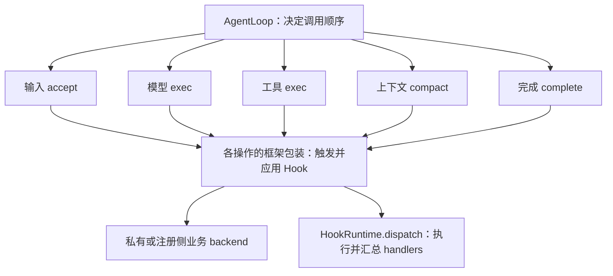

# 公共业务执行与自定义 Loop

业务实现者写业务动作，调用者使用公共操作。公共操作负责触发 Hook、落实返回值、执行业务、持久化结果和收尾。`HookRuntime::dispatch` 只负责匹配、执行、校验与聚合，不修改业务状态。

## 调度与执行的边界

Loop 继续实现原有 `AgentLoop::run_turn(TurnContext)`。`TurnExecution::open` 创建本次 turn 的业务能力，不启动 Loop，也不规定模型、工具的调用顺序。它私有持有输入路由、历史、调用身份、未结工具、取消和清理状态；这些是共享操作状态，不能由每个操作各自消费 inbox。

`DefaultLoop` 自己保存 step、强制最终回答和最后一步的继续次数，调用模型、工具和完成操作。公共模型入口接受 `ModelOptions`，默认允许工具；是否禁止工具、添加最终回答提示由调度者选择。模型重试、自动压缩和最终失败报告是模型操作的恢复契约。



## 原始 AgentLoop 的调用示例

```rust
use yourai_core::prelude::*;
use yourai_harness::execution::{Completion, ExecutionConfig, TurnExecution};

struct MyLoop;
impl AgentLoop for MyLoop {
    fn run_turn<'a>(&'a self, tc: TurnContext<'a>) -> BoxFuture<'a, TurnResult> {
        Box::pin(async move {
            let mut cx = TurnExecution::open(tc, ExecutionConfig::default()).await?;
            let result = async {
                if !cx.input_accepted() { return Ok(()); }
                // 此局部状态由 Loop 自己持有，完成被要求继续时不会重做工具。
                cx.tools().call("my_tool", serde_json::json!({})).await?;
                loop {
                    cx.checkpoint().await?;
                    if cx.complete("完成").await? == Completion::Completed {
                        return Ok(());
                    }
                    // 在这里根据新增上下文继续业务，例如 cx.model().exec().await?。
                }
            }.await;
            cx.finish(result).await
        })
    }
}
```

手动装配使用 `Agent::builder().agent_loop(...)`；完整装配使用 `HarnessConfig.agent_loop`。工作区配置更新只改变下一次 turn 的输入设置，不重新安装 Loop。

## 公共操作

| 调用 | 返回或行为 |
|---|---|
| `TurnExecution::open(tc, config)` | 恢复历史、自动接纳首条输入；拒绝结果保留在输出中 |
| `cx.inputs().accept(input)` | 触发接纳事件、附件准备和历史提交；明确拒绝返回 false |
| `cx.model().exec()` / `exec_with(options)` | 构造请求、恢复模型故障、提交响应，返回文本和待执行调用 |
| `cx.tools().exec(call_id)` | 执行已绑定且尚未结算的调用，禁止重放 |
| `cx.tools().call(name, input)` | 程序直接发起调用，自动生成身份、提交调用与结果 |
| `cx.tools().exec_pending()` | 串行执行待处理批次 |
| `cx.tools().reject_pending(reason)` | 为未执行调用提交明确失败结果；Loop 决定何时拒绝 |
| `cx.permissions().authorize(name, input)` | 校验并授权，返回最终批准的参数；不执行工具 |
| `cx.interaction().elicit(request)` | 提问或使用 Hook 答案，校验并处理结果修改 |
| `cx.context().messages()` / `compact(trigger)` | 查询历史或返回实际 CompactionResult |
| `cx.complete(text)` | 触发 Stop，返回 Completed / NeedsMoreWork |
| `cx.finish(result)` | 转移最终输出与 pending；失败时提交部分输出和真实工具结果 |
| `cx.wait(future)` / `checkpoint()` | 统一监听控制信号、路由输入和接纳 steer |

正常成功必须先通过 `complete`；输入被拒绝可以直接结束。未结工具存在时不能完成或开始下一次模型请求。`finish` 不负责调度，也不再次触发 Stop。

## 工具实现与注册

`ToolHandler::run` 是实现侧业务方法。框架正常调用通过 `ToolExecutor::exec/call`；`ToolRegistry::resolve` 返回 `ToolBinding`，其 backend 字段私有，不提供裸 run。继承已有绑定使用 `register_binding`，新工具仍使用 `register`。

`ToolBinding::exec` 通过 Core 与 Harness 之间的 `ToolOperation` 基础设施接口进入固定执行包装。正常运行时该实现是 `ToolExecutor`，内部使用私有 `ExecutionState`：校验待处理身份和绑定，执行 PreToolUse、授权、backend.run、成功/失败 post，然后提交结果。业务工具不实现这个基础设施接口。

注册后的 handler 在本次调用中保持绑定，即使 Hook 或其他调用者重新注册同名工具，本次调用也继续使用原对象。Hook 参数修改在 schema 校验、授权和执行之前生效；权限修改后的参数重新经过 schema 和硬策略检查。

## 可替换的上下文实现

`ContextManager` 实现 `prepare_compaction`，返回 `CompactionPlan`：

- `Complete`：未变更或只剪枝，已经完成相应业务操作。
- `Summary`：持有业务锁/事务的 `CompactionJob`，只实现摘要生成与提交。

公共 `context::compact` 对所有 ContextManager 使用相同包装：准备 → PreCompact → job.run → PostCompact。PreCompact 上下文合入摘要指令，PostCompact 上下文通过标准 append 保存。MemoryContext 的便捷 compact、SessionHost 的手动 compact 和 turn 内 compact 均调用此入口。

摘要任务报告提交标记，以区分提交前取消与提交后收尾失败；这是持久化契约，不是 Hook 协议。只剪枝不会触发摘要 Hook。提交后的 post 故障或阻断不会撤回摘要，CompactionResult 携带 stop_reason。直接调用低层业务 provider/backend 属于实现协议，不会自动获得公共操作的执行契约。

## 28 个 Hook 的入口

| Hook | 公共操作及内部处理 |
|---|---|
| PreToolUse | tools.exec/call：执行前检查阻断、采用修改参数和补充上下文 |
| PostToolUse | tools.exec/call：成功后采用 MCP 输出修改，保存结果与后续上下文 |
| PostToolUseFailure | tools.exec/call：失败或取消时报告，保留实际完成的结果 |
| PermissionRequest | permissions.authorize / 工具内部授权：先尝试 Hook 决定，必要时请求用户 |
| PermissionDenied | 授权拒绝路径：报告原因，执行有界重新检查 |
| UserPromptSubmit | open、inputs.accept、steer 接纳：通过后准备并提交输入 |
| Stop | complete：补充反馈/上下文，返回继续或完成，保持当前 Loop 局部状态 |
| StopFailure | model.exec：最终模型故障报告，不用于普通工具错误或取消 |
| SessionStart | SessionHost.open/restore：初始化后应用初始输入、上下文与监视路径 |
| SessionEnd | SessionHost.close：停止资源后执行结束 Hook，完成关闭提交 |
| TurnCompleted | SessionHost.run_next：成功且历史/宿主提交后通知（仅当 `through_seq > after_seq`，即本 turn 确有新提交行），不撤销结果 |
| SubagentStart | Subagents.exec_child：准备后、启动子会话前检查 |
| SubagentStop | 子代理包装：候选结束时检查；反馈进入同一子会话继续执行 |
| PreCompact | context.compact：仅摘要阶段执行，可阻断或补充指令 |
| PostCompact | context.compact：摘要提交后执行，保存补充上下文和收尾状态 |
| Elicitation | interaction.elicit / ToolContext.ask：发出 MCP 提问前采用 Hook 答案 |
| ElicitationResult | 同一交互包装：校验回答后触发，修改后再次校验 |
| TaskCreated | TaskBoard.create：准备任务后、持久化前检查 |
| TaskCompleted | TaskBoard.complete：未完成任务在提交前检查；已完成不重复触发 |
| TeammateIdle | TaskBoard.idle：确认没有未完成任务后检查 |
| Setup | Workspace.setup：执行初始化/维护扩展并应用结果 |
| Notification | Workspace.notify：应用 Hook 后发送通知；内部 Hook 日志不递归通知 |
| ConfigChange | Workspace.change_config：校验候选，Hook 通过后保存并应用业务配置 |
| InstructionsLoaded | Workspace.load_instructions：读取文件后、激活前检查 |
| WorktreeCreate | Workspace.create_worktree：Hook 可提供路径，否则执行业务创建并登记 |
| WorktreeRemove | Workspace.remove_worktree：移除前检查，通过后移除并取消登记 |
| CwdChanged | Workspace.change_cwd：验证目录后、提交切换前检查并应用监视路径 |
| FileChanged | watcher → Workspace.file_changed：检测实际变化后应用 Hook，登记运行时事件 |

Setup、idle 等本身就是操作/扩展边界，不制造空的 run 方法。事件出现次数取决于发生的业务操作，不是每次 turn 必须执行全部 28 个。

## 迁移

- 工具实现方法 `execute` 改为 `run`；自定义注册表保存 ToolBinding，实现 register_binding 和返回绑定的 resolve。
- 自定义调度继续实现 AgentLoop，直接使用 TurnExecution 的公共业务操作。
- ContextManager 的 compact 实现改为 prepare_compaction 与业务 CompactionJob；调用方使用公共 context.compact。
- DefaultLoop 和原 LoopConfig 的 struct 字段装配方式保留；ExecutionConfig 只包含业务操作策略。

计划、验收与代码位置见 [重构计划](./hook-execution-refactor.md)。
